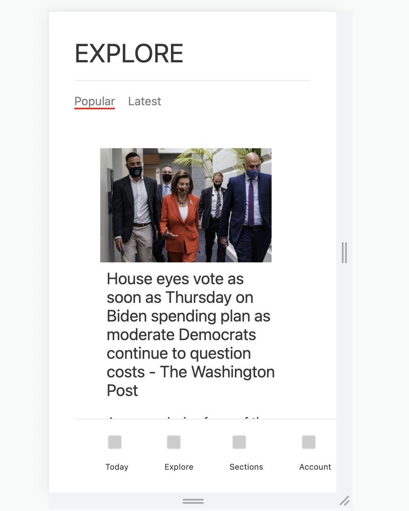

# News App Demo

### Introduction

Thank you for taking the time to check out this news app, built with Next.js. I've included instructions for firing it up, a description of the MVP and my process, and what I would do if I had more time. Enjoy!

### Instructions

1. Run `npm install`

2. Run `npm run dev`

3. Open [http://localhost:3000/](http://localhost:3000/) in your browser.

4. Use DevTools to adjust dimensions for mobile device. App should resemble the following image:

### Explanation of MVP

This project represents roughly 4 hours of work. I spent the first 2/2.5 hours reaching MVP and refactoring my code. I spent the remainder of my time trying to incorporate GraphQL (more on this in the next section). 

I was able to complete the following tasks:

*  A user should see the “Explore” header at the top of the screen.

* A user should be able to view a reverse chronological feed of top-headline news by scrolling down the page.

* A user should be able to click on an article’s promo image or headline and be taken to the full story content on the original publisher’s site.

* To the best of your ability, please match the styles shown in the “Explore” tab of the webview in the designs.

* Clicking on the "Today" icon in the footer redirects users to The Atlantic home page (I noticed that functionality in the mock up and wasn't sure if that was a part of this assignment)

A few notes on process:

* I decided to build this app with Next.js because I've been working with it recently and I felt confident in my ability to fetch data from the News API by using the built in method, `getServerSideProps`. The CSS that comes with `create-next-app` isn't terribly different from the CSS shown in the mock-up, so I figured I could save a little time by using the fonts and styles that are included.

* After reaching MVP, I refactored a bit to break up the page into separate components and to use CSS modules to style each component. I was able to get reasonable close to the CSS in the mock up. 

### If I had more time...

* I have a experience working with GraphQL and REST APIs - but I've never wrapped an existing REST API in GraphQL! I spent the last chunk of my time trying to figure out how to do this when time ran up. I'm curious to know if there is a better way to do this. If I were working with a team, this is definitely where I would have reached out for help! To view my work, see `utils/graphqlSchema.js`.

* There is definitely more that I could have done to adjust the CSS for this project. Some of it is still make-shift and could be easily broken. 

* Outside of assignment requirements - I would refactor to get Next.js' `Link` and `Image` components working. I was running into errors while trying to implememnt them and decided to abandon this in favor of other tasks. If `Link` were functional, I could also work on setting up routing for the other tabs listed in the footer.

### Conclusion

Thank you for the opportunity to particpate in this step. I had a lot of fun working on thsi project and look forward to hearing feedback from the team about what I was able to accomplish.

**Sarah Evans**